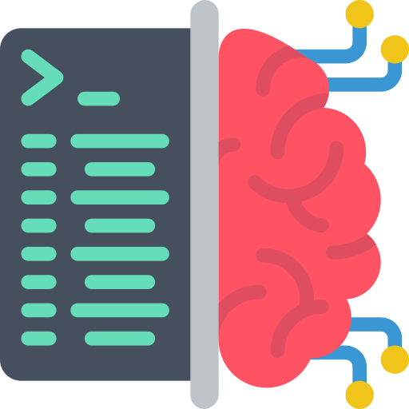

<div align="center">



# QA-MLLM (Question Answering - Multiple Large Language Models)

</div>

## Introduction

This project is a question answering system based on huggingface transformers. It is a combination of a multiple large language models (MLLM) in cascade in order to be able to answer question from any language and from any input type, such as pdf, html, docx, images, videos, audio, etc.

## Installation

Work in progress ...

## Usage

To use the application, you have two options:

1. Use the CLI application
2. Use the GUI application

### CLI application

```bash
qa-mlm --help
```

### GUI application

```bash
qa-mlm-gui --help
```

## Development

```bash
conda env create -f environment.yml
```

```bash
conda activate qa-mlm
```

## In progress

- [x] Allow to use `.md` as context input
- [x] Allow to use `.pdf` as context input
- [ ] Allow to use `.html` as context input
- [ ] Allow to use `.docx` as context input
- [ ] Allow to use images as context input
- [ ] Allow to use videos as context input
- [ ] Allow to use audio as context input
- [x] Allow to use other languages as context input
- [ ] Add translation option for context input
- [x] Create CLI application
- [x] Create GUI application
- [ ] Allow to specify the model to use
- [ ] Allow hot swapping of models
- [ ] Allow hot swapping of tokenizer
- [ ] Allow hot swapping of context input
- [ ] Allow to record the conversation

## License

This project is licensed under the terms of the MIT license. See [LICENSE](LICENSE) for additional details.
